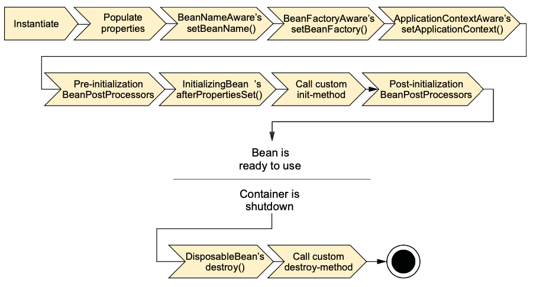

# Module #2. REST API Basics

## Spring

### IoC & DI. What is the difference? Other IoC implementations.
> [Baeldung article](https://www.baeldung.com/inversion-control-and-dependency-injection-in-spring)

**Inversion of Control** is a principle in software engineering which transfers the control of objects or portions of a program to a container or framework. We most often use it in the context of object-oriented programming.

In contrast with traditional programming, in which our custom code makes calls to a library, IoC enables a framework to take control of the flow of a program and make calls to our custom code. To enable this, frameworks use abstractions with additional behavior built in. If we want to add our own behavior, we need to extend the classes of the framework or plugin our own classes.

The advantages of this architecture are:
- decoupling the execution of a task from its implementation
- making it easier to switch between different implementations
- greater modularity of a program
- greater ease in testing a program by isolating a component or mocking its dependencies, and allowing components to communicate through contracts

We can achieve Inversion of Control through various mechanisms such as: *[Strategy design pattern](https://en.wikipedia.org/wiki/Strategy_pattern)*, *[Service Locator pattern](https://ru.wikipedia.org/wiki/Локатор_служб)*, *Factory pattern*, and *Dependency Injection*.

**Dependency injection** is a pattern we can use to implement IoC, where the control being inverted is setting an object's dependencies. Connecting objects with other objects, or “injecting” objects into other objects, is done by an assembler rather than by the objects themselves.

An IoC container is a common characteristic of frameworks that implement IoC. In the Spring framework, the interface `ApplicationContext` represents the IoC container. The Spring container is responsible for instantiating, configuring and assembling objects known as beans, as well as managing their life cycles.

### How can we configure Spring context?
> [*Baeldung article*](https://www.baeldung.com/spring-application-context)

1. **Java-based configuration.** Since Spring 3.0 Java-based configuration is available. Java configuration typically uses `@Bean`-annotated methods within a `@Configuration` class. The `@Bean` annotation on a method indicates that the method creates a Spring bean. Moreover, a class annotated with` @Configuration` indicates that it contains Spring bean configurations.
2. **Annotation-based configuration**. Spring 2.5 introduced annotation-based configuration as the first step to enable bean configurations in Java.In this approach, we first enable annotation-based configuration via XML configuration. Then we use a set of annotations on our Java classes, methods, constructors, or fields to configure beans. Some examples of these annotations are `@Component`, `@Controller`, `@Service`, `@Repository`, `@Autowired`, and `@Qualifier`.
```xml
<context:annotation-config/>
<context:component-scan base-package="com.baeldung.applicationcontext"/>
```

3. **XML-based configuration.** This is the traditional way of configuring beans in Spring. In this approach, we do all bean mappings in an XML configuration file.

```xml
<?xml version="1.0" encoding="UTF-8"?>
<beans xmlns="http://www.springframework.org/schema/beans"
  xmlns:xsi="http://www.w3.org/2001/XMLSchema-instance"
  xsi:schemaLocation="
    http://www.springframework.org/schema/beans 
    http://www.springframework.org/schema/beans/spring-beans.xsd">
	  
  <bean id="accountService" class="com.baeldung.applicationcontext.AccountService">
    <constructor-arg name="accountRepository" ref="accountRepository" />
  </bean>
	
  <bean id="accountRepository" class="com.baeldung.applicationcontext.AccountRepository" />
</beans>
```

`ApplicationContext` implementations:
- `AnnotationConfigApplicationContext` — Loads a Spring application context from one or more Java-based configuration classes
- `AnnotationConfigWebApplicationContext` — Loads a Spring web application context from one or more Java-based configuration classes
- `ClassPathXmlApplicationContext` — Loads a context definition from one or more XML files located in the classpath, treating context-definition files as classpath resources
- `FileSystemXmlApplicationContext` — Loads a context definition from one or more XML files in the filesystem
- `XmlWebApplicationContext` — Loads context definitions from one or more XML files contained in a web application

### Spring Bean lifecycle.



1. Spring instantiates the bean.
2. Spring injects values and bean references into the bean’s properties.
3. If the bean implements BeanNameAware, Spring passes the bean’s ID to the `setBeanName()` method.
4. If the bean implements `BeanFactoryAware`, Spring calls the `setBeanFactory()` method, passing in the bean factory itself.
5. If the bean implements `ApplicationContextAware`, Spring calls the `setApplicationContext()` method, passing in a reference to the enclosing application context.
6. If the bean implements the `BeanPostProcessor` interface, Spring calls its `postProcessBeforeInitialization()` method.
7. If the bean implements the `InitializingBean` interface, Spring calls its `afterPropertiesSet()` method. Similarly, if the bean was declared with an **init-method**, then the specified initialization method is called.
8. If the bean implements `BeanPostProcessor`, Spring calls its `postProcessAfterInitialization()` method.
9. At this point, the bean is ready to be used by the application and remains in the application context until the application context is destroyed.
10. If the bean implements the `DisposableBean` interface, Spring calls its `destroy()` method. Likewise, if the bean was declared with a destroy-method, the specified method is called.


### Injection with annotations. What types exist? Advantages and disadvantages of those types? 

> [Baeldung article](https://www.baeldung.com/inversion-control-and-dependency-injection-in-spring)

#### Constructor-Based Dependency Injection
> [Advantages of constructor-based injection](https://reflectoring.io/constructor-injection/)

In the case of constructor-based dependency injection, the container will invoke a constructor with arguments each representing a dependency we want to set.

Spring resolves each argument primarily by type, followed by name of the attribute, and index for disambiguation.

```java
public class Store {
    private Item item;
    
    @Autowired
    public Store(Item item) {
        this.item = item;
    }
}
```

#### Setter-Based Dependency Injection
For setter-based DI, the container will call setter methods of our class after invoking a no-argument constructor or no-argument static factory method to instantiate the bean. 
It is possible to combine constructor-based and setter-based types of injection for the same bean. The Spring documentation recommends using constructor-based injection for mandatory dependencies, and setter-based injection for optional ones.
```java
public class Store {
    private Item item;
    
    public Store() {}
    
    @Autowired(required = false)
    public setItem(Item item) {
        this.item = item;
    }
}
```

#### Field-Based Dependency Injection
In case of Field-Based DI, we can inject the dependencies by marking them with an `@Autowired` annotation:
```java
public class Store {
    @Autowired
    private Item item; 
}
```

Drawbacks of filed-based DI:
1. This method uses reflection to inject the dependencies, which is costlier than constructor-based or setter-based injection.
2. It's really easy to keep adding multiple dependencies using this approach. If we were using constructor injection, having multiple arguments would make us think that the class does more than one thing, which can violate the Single Responsibility Principle.

### What is the difference between `@Repository`, `@Component`, `@Service` and `@Controller` annotations?
> [Baeldung article](https://www.baeldung.com/spring-component-repository-service)

`@Service` is just a alias for `@Component` and only acts as specialization of `@Component`.

`@Repository` is also a specialization of `@Component`  but it’s job is to catch persistence-specific exceptions and re-throw them as one of Spring’s unified unchecked exceptions

`@Controller` is another specialization for `@Component` but is processed differently under the hood. As a consequence annotations such as `@RequestMapping` will only work with `@Controller`s.

### Spring Bean scopes. What scopes exist out of the box? Is it possible to create a custom scope?
> [Baeldung article](https://www.baeldung.com/spring-bean-scopes)

The latest version of the Spring framework defines 6 types of scopes:
1. singleton
2. prototype
3. request
4. session
5. application
6. websocket

The last four scopes mentioned, request, session, application and websocket, are only available in a web-aware application.

The scope of bean is defined by `@Scope` annotation:
```java
@Bean
@Scope("prototype")
// @Scope(value = ConfigurableBeanFactory.SCOPE_PROTOTYPE)
public ExampleBean exampleBean() {
    return new ExampleBean();
}
```

#### Singleton Scope
When we define a bean with the **singleton scope**, the container creates a single instance of that bean; all requests for that bean name will return the same object, which is cached. Any modifications to the object will be reflected in all references to the bean. This scope is the default value if no other scope is specified.

#### Prototype Scope
A bean with the **prototype scope** will return a different instance every time it is requested from the container.

#### Request Scope
The **request scope** creates a bean instance for a single HTTP request.

#### Session Scope
The **session scope** creates a bean instance for an HTTP session.

#### Application Scope
The **application scope** creates the bean instance for the lifecycle of a **Servlet Context**.

This is similar to the singleton scope, but there is a very important difference with regard to the scope of the bean.

When beans are application scoped, the same instance of the bean is shared across multiple servlet-based applications running in the same **Servlet Context**, while singleton scoped beans are scoped to a single application context only.

#### WebSocket Scope
When first accessed, **WebSocket scoped** beans are stored in the WebSocket session attributes. The same instance of the bean is then returned whenever that bean is accessed during the entire WebSocket session. We can also say that it exhibits singleton behavior, but limited to a WebSocket session only.

### How to add several configurations in application (db, connection pool settings) and choose one of them at startup?
> [Baeldung article](https://www.baeldung.com/spring-profiles)

Profiles allow us to map our beans to different profiles — for example, dev, test, and prod.

The `@Profile` annotation is used to map the bean to that particular profile; the annotation simply takes the names of one (or multiple) profiles.
```java
@Component
@Profile("dev")
public class DevDatasourceConfig
```

Profiles can be set in different ways. Here are some of them:

#### Via `WebApplicationInitializer`
```java
@Configuration
public class MyWebApplicationInitializer 
  implements WebApplicationInitializer {

    @Override
    public void onStartup(ServletContext servletContext) throws ServletException {
 
        servletContext.setInitParameter(
          "spring.profiles.active", "dev");
    }
}
```

#### Via ConfigurableEnvironment
```java
@Autowired
private ConfigurableEnvironment env;
...
env.setActiveProfiles("someProfile");
```

#### As context Parameter in web.xml
```xml
<context-param>
    <param-name>spring.profiles.active</param-name>
    <param-value>dev</param-value>
</context-param>
```

#### As JVM System Parameter
```
-Dspring.profiles.active=dev
```

## REST


### REST Principles
1. **Uniform interface.** All API requests for the same resource should look the same, no matter where the request comes from. The REST API should ensure that the same piece of data, such as the name or email address of a user, belongs to only one uniform resource identifier (URI). Resources shouldn’t be too large but should contain every piece of information that the client might need.
2. **Client-server decoupling.** In REST API design, client and server applications must be completely independent of each other. The only information the client application should know is the URI of the requested resource; it can't interact with the server application in any other ways. Similarly, a server application shouldn't modify the client application other than passing it to the requested data via HTTP.
3. **Statelessness.** REST APIs are stateless, meaning that each request needs to include all the information necessary for processing it. In other words, REST APIs do not require any server-side sessions. Server applications aren’t allowed to store any data related to a client request.
4. **Cacheability.** When possible, resources should be cacheable on the client or server side. Server responses also need to contain information about whether caching is allowed for the delivered resource. The goal is to improve performance on the client side, while increasing scalability on the server side.
5. **Layered system architecture.** In REST APIs, the calls and responses go through different layers. As a rule of thumb, don’t assume that the client and server applications connect directly to each other. There may be a number of different intermediaries in the communication loop. REST APIs need to be designed so that neither the client nor the server can tell whether it communicates with the end application or an intermediary.
6. **Code on demand (optional).** REST APIs usually send static resources, but in certain cases, responses can also contain executable code (such as Java applets). In these cases, the code should only run on-demand.

### HTTP methods for Rest API

| HTTP Method | Meaning |
|:--|:--|
| POST | Create |
| GET | Read |
| PUT | Update entirely/replace |
| PATCH | Update partially/modify |
| DELETE | Delete |

### What does Richardson's maturity model describes?
The RMM can be employed to determine how well a Web service architecture adheres to REST principles. It categorizes a Web API into four levels (from 0 to 3) with each higher level corresponding to a more complete adherence to REST design. The next level also contains all the characteristics of the previous one.

#### Level 0 : The Swamp of POX
The lowest level of the model describes a Web API with a single URI (typically POST over HTTP) accepting all the range of operations supported by the service. Resources in this form cannot be well-defined. Messaging is done in XML, JSON, or other text formats. These are typical RPC POX and many SOAP services.

#### Level 1 : Resources
Introduces resources and allows to make requests to individual URIs (still all typically POST) for separate actions instead of exposing one universal endpoint (API). The API resources are still generalized but it is possible to identify the scope of each one.
Level One design is not RESTful, yet it is organizing the API in the direction of becoming one.

#### Level 2 : HTTP verbs
The system starts making use of HTTP Verbs. This allows to further specialize the resource and thus narrow down the functionality of each individual operation with the service. The principle separation at this level consists in splitting a given resource into two — one request for obtaining data only (GET), the other for modifying the data (POST). Further granularization is also possible. GET requests only fetch data, POST/PUT calls introduce new and update existing data, DELETE requests remove or otherwise invalidate previous actions. One drawback of providing a distributed service with more than GET and POST per resource might be growing complication of using such a system.

#### Level 3 : Hypermedia controls
The last level introduces the hypermedia representation. Also called HATEOAS (Hypermedia As The Engine of Application State), these are elements embedded in the response messages of resources which allow to establish a relation between individual data entities returned from and pass to the APIs. For instance, a GET request to a hotel reservation system might return a number of available rooms along with hypermedia links (these would be html hyperlink controls in the early days of the model) allowing to book specific rooms.

### Idempotency of methods. Idempotent REST methods.
Idempotent operations produce the same result even when the operation is repeated many times.

Only POST method is not Idempotent.

### Do you know some practices for API versioning?
API versioning is the practice of transparently managing changes to your API.

#### URI Path
```
http://www.example.com/api/v1/products
```

This strategy involves putting the version number in the path of the URI, and is often done with the prefix "v".

URI path versioning implies orchestrated releases of application versions that will require one of two approaches: maintaining one version while developing a new one or forcing consumers to wait for new resources until the new version is released. It also means you'd need to carry over any non-changed endpoints from version to version. However, for APIs with relatively low volatility, it's still a decent option.

#### Query Params
```
http://www.example.com/api/products?version=1
```

This type of versioning adds a query param to the request that indicates the version. Very flexible in terms of requesting the version of the resource you'd like at the "leaf" level, but it holds no notion of the overall API's version and lends itself to the same out-of-sync issues mentioned in the above comment on endpoint-level versioning of the URI path.

#### Header
```
Accept: version=1.0
```

The header approach is one that provides more granularity in serving up the requested version of any given resource.

However, it's buried in the request object and isn't as transparent as the URI path option. It's also still hard to tell whether 1.0 refers to the version of the endpoint or the API itself.

## Engineering Excellence

### Testing. What types of tests exist?

#### Unit tests
Unit tests are very low level, close to the source of your application. They consist in testing individual methods and functions of the classes, components or modules used by your software. Unit tests are in general quite cheap to automate and can be run very quickly by a continuous integration server.

#### Integration tests
Integration tests verify that different modules or services used by your application work well together. For example, it can be testing the interaction with the database or making sure that microservices work together as expected. These types of tests are more expensive to run as they require multiple parts of the application to be up and running.

#### System tests
System tests test the developed system as whole. For small apps this may be as simple as running it ad clicking all the buttons.

## Database

### What is DB index? How does it work?
Индексы почти полностью лежат в области физического уровня проектирования базы данных, и реляционная теория их почти не затрагивает.

**Индекс** — специальная структура базы данных, используемая для ускорения поиска записей и физического доступа к записям.
Это механизм, значительно ускоряющий поиск необходимой ин- формации в базе данных (по аналогии: для человека карта города является таким «индексом», позволяющим быстро найти нужное здание).

Индексы широко используются при проектировании баз данных в силу следующих преимуществ:
- размер индексов значительно меньше размера индексированных данных, что позволяет размещать их в оперативной памяти для ускорения доступа;
- структура индексов специальным образом оптимизирована для выполнения операций поиска.
Как следствие двух предыдущих пунктов, индексы значительно (иногда — на несколько порядков) ускоряют поиск данных.

Однако, у индексов есть и недостатки, которые обязательно следует учитывать, чтобы не создавать индексы там, где они не нужны:
- когда индексов становится много, они занимают ощутимый объём оперативной памяти;
- наличие индексов ощутимо замедляет операции модификации данных (вставки, удаления, обновления), т.к. при изменении данных СУБД необходимо обновить индексы, приведя их в соответствие с новыми значениями индексированных данных.

По соотношению с расположением записей индексируемой таблицы индексы делятся на кластерные (и первичные — как их подвид) и некластерные.
- **Кластерный индекс (clustered index)** — индекс, построенный на поле (возможно, с неуникальными значениями), по которому произведено физическое упорядочивание данных в файле.
> Упрощённо: по значению индексированного поля данные таблицы физически отсортированы на диске; значения поля могут повторяться.

- **Первичный индекс (primary index)** — индекс, построенный на поле с уникальными значениями, по которому произведено физическое упорядочивание данных в файле.
> Упрощённо: по значению индексированного поля данные таблицы физически отсортированы на диске; значения поля не могут повторяться.


- **Некластерный индекс (non-clustered index)** — индекс, построенный на поле, по которому не произведено физическое упорядочивание данных в файле.
> Упрощённо: «просто индекс», принципы упорядочивания в котором никак не связаны с физическим расположением данных на диске.

Некластерные индексы отличаются от кластерных тем, что последовательность записей в индексе и физическом файле не совпадает. Как правило, это приводит к усложнению структуры самого индекса из-за необходимости хранения нескольких разных адресов записей с совпадающими значениями индексируемого поля.


По степени детализации индексы бывают плотными и неплотными:
1. **Плотный индекс (dense index)** — индекс, содержащий указатель на расположение записи для каждого значения индексируемого поля.
> Упрощённо: в индексе хранятся адреса каждой записи таблицы.

2. **Неплотный индекс (sparse index)** — индекс, содержащий указатель на расположение блока записей для каждого значения (в случае их неуникальности) или группы значений (в случае их уникальности) индексируемого поля.
> Упрощённо: в индексе хранятся адреса блоков (групп) записей.


### Types of keys. Why we need a key?
**Ключ** — идентификатор, являющийся частью набора элементов данных. В контексте реляционных СУБД ключом считается совокупность атрибутов отношения (или отдельный атрибут), обладающий определёнными, характерными для данного вида ключа свойствами.

**Суперключ** — подмножество атрибутов отношения, уникально идентифицирующее любой кортеж. Суперключ часто называют надмножеством потенциального ключа, т.к. он может содержать в себе «лишние» элементы, удаление которых не приведёт к потере уникальности значений (т.к. суперключ не обладает свойством несократимости).

**Потенциальный ключ** — несократимое подмножество атрибутов отношения, уникально идентифицирующее любой кортеж. Иными словами, потенциальный ключ — это такой суперключ, в котором нет «лишних» элементов. Как правило, один из потенциальных ключей в дальнейшем становится первичным ключом (а остальные потенциальные ключи становятся альтернативными ключами).

**Альтернативный ключ** — потенциальный ключ отношения, не выбранный в качестве первичного ключа.

**Первичный ключ (PK)** — потенциальный ключ, выбранный в качестве основного средства гарантированной идентификации кортежей отношения.

**Простой ключ** — ключ, состоящий из одного атрибута отношения.

**Составной ключ** — ключ, состоящий из двух и более атрибутов отношения.

**Естественный ключ** — ключ, построенный на множестве атрибутов отношения, несущих смысловую нагрузку.

**Искусственный ключ** — ключ, построенный на атрибуте, искусственно добавленном в отношение с единственной целью — гарантированно идентифицировать кортежи отношения.

**Внешний ключ (FK)** — атрибут (или группа атрибутов) отношения, содержащий в себе копии значений первичного ключа другого отношения.

**Рекурсивный внешний ключ (RFK)** — атрибут (или группа атрибутов) отношения, содержащий в себе копии значений первичного ключа этого же отношения.

### What is transaction? What is ACID? What is Isolation levels (reading)? What propagation types do you know?
**Транзакция** — набор операций с базой данных, который представляет собой неделимую логическую единицу. Такой набор операций может быть выполнен либо целиком и успешно (с соблюдением всех правил консистентности базы данных и независимо от параллельно выполняемых транзакций), либо не выполнен вообще (в таком случае ни одна из операций, входящих в данный набор, не должна произвести никаких изменений в базе данных).

#### ACID
**Атомарность (atomicity)** означает, что транзакция не может быть «выполнена частично», т.е. что всегда все её операции будут либо выполнены (все и до конца), либо не выполнены.

**Консистентность (consistency)** означает, что успешно завершившаяся транзакция гарантированно сохраняет консистентность базы данных, т.е. фиксирует только допустимые результаты изменения данных (не противоречащие никаким ограничениям, реализованным на уровне СУБД или добавленным отдельно в базу данных в виде проверок, триггеров и т.д.).

**Изолированность (isolation)** означает, что несколько выполняемых параллельно транзакций не должны влиять на результат выполнения друг друга.

**Устойчивость (durability)** означает, что СУБД сама решает все «внутренние проблемы» и гарантирует, что после завершения транзакции (как успешного, так и неуспешного) все необходимые изменения были или зафиксированы, или отменены, и что база данных не вернётся в некое «промежуточное состояние».

#### Transaction Isolation Level
Типичные проблемы, которые могут возникать при одновременном доступе к одним и тем же данным нескольких транзакций:
1. **Потерянное обновление (lost update)** — сохраняются только те изменения данных, которые были выполнены позже всего.
2. **Грязное чтение (dirty read)** — становится доступным временное состояние данных, которые в дальнейшем будут удалены или изменены в силу отмены работавшей с ними транзакции.
3. **Неповторяющееся чтение (non-repeatable read)** — происходит изменение одних и тех же данных за время работы транзакции (т.е. при повторном чтении ра- нее прочитанных данных получается новый результат).
4. **Фантомное чтение (phantom reads)** — происходит изменение количества строк, подпадающих под выборку (в силу добавления или удаления строк или изменения значений в их полях).

**Уровень изолированности транзакций (transaction isolation level)** — условное значение, показывающее, насколько внутреннее состояние базы данных в момент выполнения транзакции доступно другим, одновременно выполняемым транзакциям или насколько параллельно выполняемые транзакции «защищены» друг от друга.

**Чтение неподтверждённых данных, грязное чтение (read uncommitted, dirty read)** — допускает чтение незафиксированных (т.е. до подтверждения или отмены транзакции) изменений — выполненных любой транзакцией (как той, что производит чтение, так и выполняющихся параллельно с ней).

**Чтение подтверждённых данных (read committed)** — допускает чтение всех изменений, выполненных самой транзакцией, и только подтверждённых (зафиксированных) изменений, выполненных другими (параллельными) транзакциями.

**Повторяющееся чтение (repeatable read)** — допускает только чтение изменений, выполненных самой транзакцией, а прочитанные ею данные становятся недоступными для изменения параллельным транзакциям.

**Снимок (snapshot)** — является частным (более высоким) случаем повторяющегося чтения, поддерживается не всеми СУБД, и допускает только чтение изменений, выполненных самой транзакцией, а прочитанные ею данные остаются доступны для изменения параллельным транзакциям (в этом состоит основное отличие от уровня повторяющегося чтения).

**Сериализация (serializable)** — допускает только такое выполнение изменений данных, словно все модифицирующие данные транзакции выполняются не параллельно, а последовательно.
Этот уровень обеспечивает отсутствие всех проблем, т.е. потерянных обновлений, грязного чтения, неповторяющегося чтения и фантомного чтения. Это самый надёжный в плане точности работы с данными уровень изолированности транзакций, но он же — и самый медленный с точки зрения производительности.

#### Types of Propagation
> [Baeldung article](https://www.baeldung.com/spring-transactional-propagation-isolation#transaction-propagations)

1. **REQUIRED** is the default propagation. Spring checks if there is an active transaction, and if nothing exists, it creates a new one. Otherwise, the business logic appends to the currently active transaction.
2. For **SUPPORTS**, Spring first checks if an active transaction exists. If a transaction exists, then the existing transaction will be used. If there isn't a transaction, it is executed non-transactional.
3. When the propagation is **MANDATORY**, if there is an active transaction, then it will be used. If there isn't an active transaction, then Spring throws an exception.
4. For transactional logic with **NEVER** propagation, Spring throws an exception if there's an active transaction.
5. With **NOT_SUPPORTED** propagation if a current transaction exists, first Spring suspends it, and then the business logic is executed without a transaction.
6. When the propagation is **REQUIRES_NEW**, Spring suspends the current transaction if it exists, and then creates a new one.
7. For **NESTED** propagation, Spring checks if a transaction exists, and if so, it marks a save point. This means that if our business logic execution throws an exception, then the transaction rollbacks to this save point. If there's no active transaction, it works like REQUIRED.

## General
### Describe, how HTTP request is processed.


1. Request goes to `DispatcherServlet`.
2. `DispatcherServlet` decides on controller which will process the request with help of **handler mapping**.
3. Once an appropriate controller has been chosen, `DispatcherServlet` sends the request to the chosen controller. At the controller, the request drops off its payload (the information submitted by the user) and waits while the controller processes that information. 
4. Controller packages up the model data and identify the name of a view that should render the output. It then sends the request, along with the model and view name, back to the `DispatcherServlet`.
5. The `DispatcherServlet` consults a **view resolver** to map the logical view name to a specific view implementation.
6. Now that `DispatcherServlet` knows which view will render the result, the request’s job is almost over. Its final stop is at the **view implementation** where it delivers the model data.
7. The **view** will use the model data to render output that will be carried back to the client by the response object

